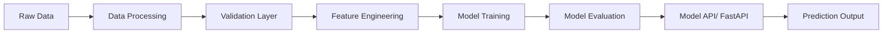

# Vincent Nnamdi Ugwah
Data Scientist | Machine Learning Engineer | Frontend Developer (React)  

Building production-ready ML systems and data-driven applications  
MSc Artificial Intelligence, University of Essex, UK

---

## About Me

I build production-ready machine learning systems and data-driven applications, taking solutions from raw data to real-world use.
My work focuses on designing reliable pipelines, ensuring data quality, and deploying models that perform under real-world conditions, alongside building intuitive user interfaces.

* Focus: Machine learning, data systems, predictive modeling, and full-stack applications
* Strengths: End-to-end development, data validation, and reproducible workflows
* Tech stack:Python (Pandas, NumPy, Scikit-learn, TensorFlow), SQL, feature engineering, model training, ML pipelines, Docker, Azure, React
* Based in Canada

---


## Core Expertise

* Design and build end-to-end machine learning systems from data ingestion to model evaluation
* Implement data validation, schema enforcement, and robust pipeline reliability checks
* Develop supervised learning models for classification and anomaly detection
* Build reproducible and scalable ML workflows with testing, version control, and modular pipeline design


---
## Skills
### Programming & Data


* Data analysis, preprocessing, and feature engineering

---

### Machine Learning


* Model training, evaluation, and optimization
* Classification and anomaly detection
* Metrics: AUC, precision, recall

---

### Data Engineering & Pipelines

* Data ingestion and preprocessing pipelines
* Data validation (schema, range, label checks)
* Workflow automation and reproducible pipelines

---

### Tools & Infrastructure


* API development (FastAPI)
* Version control and testing

---

### Frontend


* Building user interfaces for data-driven applications

---

## 🚀 Flagship Project

### Credit Card Fraud Detection System (Production-Ready)

🔗 https://github.com/vincent4u/fraud-detection

Designed and deployed an end-to-end fraud detection system, from raw transactional data to real-time prediction, using production-oriented ML engineering practices.

---

### System Overview

* Built a complete pipeline from data ingestion to model inference
* Integrated data validation, feature engineering, model training, and prediction services
* Designed for scalability, reproducibility, and real-time usage

---

### Architecture

* **Data Layer:** Raw → processed datasets with schema validation and quality checks
* **Model Layer:** Classification models (Logistic Regression, XGBoost)
* **Service Layer:** REST API for real-time fraud prediction
* **Deployment Layer:** Docker-based containerization for consistent environments

---

### Key Features

* Automated data validation (schema, range, and label checks)
* Time-based data splitting for realistic evaluation
* Feature engineering for imbalanced classification
* REST API endpoint for live predictions
* Modular, testable, and extensible pipeline design

---

### Results

* Achieved **AUC: 0.98+** on validation data
* Improved fraud recall while maintaining precision balance
* Reduced false negatives in high-risk transaction scenarios

---

### Deployment

* Built REST API using FastAPI for real-time inference
* Containerized application with Docker
* Structured for deployment on cloud platforms such as Azure

---

### Example API Usage

```bash
POST /predict

{
  "time": 12345,
  "amount": 250.0,
  "features": [...]
}
```

**Response**

```json
{
  "fraud_probability": 0.92,
  "prediction": 1
}
```

---

### Impact

* Demonstrates ability to build end-to-end, production-ready ML systems
* Highlights strong data validation and pipeline reliability practices
* Reflects real-world ML engineering workflows from data to deployment

---
### Architecture Diagram



## Featured Projects

### Machine Learning Projects

#### Credit Card Fraud Detection System

🔗 https://github.com/vincent4u/fraud-detection

Built a cost-sensitive machine learning system for fraud detection under extreme class imbalance.

* XGBoost and Logistic Regression with threshold tuning
* Precision–recall optimization and model calibration
* End-to-end pipeline with validation and reproducibility

**Impact:**
Improved detection of rare fraud events while controlling false positives

---

#### Credit Risk Modeling (Explainable ML)

🔗 https://github.com/vincent4u/credit-risk-model

Developed interpretable models for predicting probability of default.

* Gradient boosting with logistic regression baseline
* SHAP-based interpretability and calibration checks
* Designed for transparent, decision-ready outputs

**Impact:**
Enables risk-informed decisions with explainable predictions

---

#### V²PlantNet (Published Research)

🔗 https://github.com/vincent4u/v2plantnet

Designed a lightweight CNN for multi-class plant disease classification.

* Modified MobileNet architecture for efficiency
* Achieved **98% test accuracy** with a **1.46MB model**
* Structured validation and cross-validation

**Impact:**
Demonstrates efficient deep learning under resource constraints

---

#### Data Validation Framework

🔗 https://github.com/vincent4u/data-validation

Built a reusable framework for validating structured datasets in ML pipelines.

* Schema enforcement and range checks
* Label validation and pipeline safeguards
* Integrated automated testing

**Impact:**
Improves data reliability and prevents pipeline failures

---

### ML Pipeline Template

🔗 https://github.com/vincent4u/ml-pipeline-template

Designed a modular and reusable template for building scalable machine learning workflows.

* Structured pipeline for data ingestion, preprocessing, and model training
* Integrated data validation and test coverage across stages
* Built for reuse, extensibility, and consistent ML development practices

**Impact:**
Reduces development time and enforces reliable, production-oriented ML standards

---

### Frontend Projects (React)

#### ML Dashboard (Fraud Detection UI)

🔗 https://github.com/vincent4u/fraud-dashboard

Built a React-based dashboard for interacting with a machine learning fraud detection system.

* Integrated FastAPI backend for real-time predictions
* Designed responsive UI for input, results, and visualization
* Displayed fraud probability, risk levels, and insights

**Impact:**
Demonstrates ability to connect ML systems with user-facing applications

---

#### Data Visualization App

🔗 https://github.com/vincent4u/data-visualization-app

Developed a React application for exploring and visualizing datasets.

* Interactive charts using Chart.js / Recharts
* Dynamic filtering and data exploration
* Clean and responsive UI design

**Impact:**
Enables intuitive understanding of complex data through visualization

---
#### ML Insights Dashboard (React + API)

🔗 https://github.com/vincent4u/ml-insights-dashboard

Built a responsive dashboard for interacting with data-driven systems in real time.

* Integrated API endpoints for dynamic data and predictions
* Designed clean UI for input, results, and visualization
* Implemented charts and risk indicators using Recharts
* Structured reusable components for scalability

**Impact:**
Demonstrates ability to connect data systems with intuitive, user-facing interfaces

---

#### Task Management App (Interactive UI)

🔗 https://github.com/vincent4u/task-manager-app

Developed an interactive productivity application with dynamic state management.

* Create, update, and delete tasks with real-time UI updates
* Implemented component-based architecture and state handling
* Added filtering, status tracking, and responsive layout
* Integrated API layer for persistent data handling

**Impact:**
Showcases strong frontend fundamentals including state management and user interaction

---

#### Modern SaaS Landing Page (UI/UX Focus)

🔗 https://github.com/vincent4u/saas-landing-page

Designed and built a modern, responsive landing page with a focus on UI/UX.

* Clean layout with structured sections and typography
* Responsive design across mobile, tablet, and desktop
* Added animations and transitions for improved user experience
* Optimized for performance and visual clarity

**Impact:**
Highlights ability to build polished, production-quality interfaces with strong design principles

---


## GitHub Stats


---

## Professional Focus

### As a Data Scientist

* Build predictive models and extract insights from data
* Apply statistical and machine learning techniques
* Focus on model performance, evaluation metrics, and data-driven decision making

### As a Machine Learning Engineer

* Design scalable and reliable ML pipelines
* Ensure data quality, validation, and reproducibility
* Deploy and maintain production-ready systems

### As a Frontend Developer

* Build responsive user interfaces using React
* Integrate APIs and data-driven features into applications
* Design intuitive interfaces for data visualization and user interaction

---

## Interests

* Machine learning systems and model optimization
* Data engineering and pipeline design
* Scalable ML infrastructure
* Building user-facing applications powered by data

---

## Connect

* LinkedIn: https://www.linkedin.com/in/vincent-ugwah/
* Email: [vincent.ugwah@gmail.com](mailto:vincent.ugwah@gmail.com)


---

